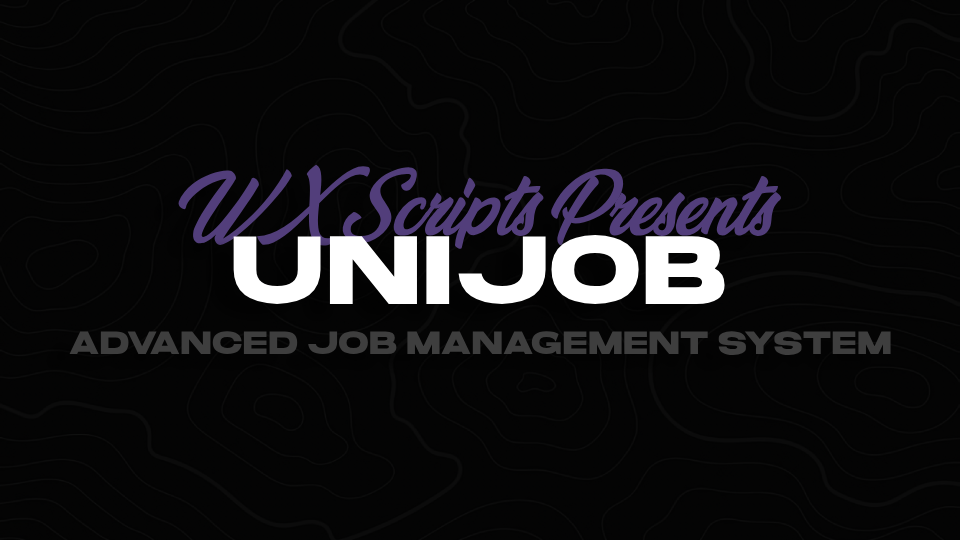

**This resource is EXPERIMENTAL, expect bugs and NO SUPPORT! PRs are welcome!**

# About

WX UniJob is an advanced system for creating and managing all your jobs with a single resource.
## Dependencies
* [ox_lib](https://github.com/overextended/ox_lib) - Used for UI, callbacks and more
* [WX Bridge](https://github.com/nwvh/wx_bridge) - Custom bridge module that adds support for ESX & QB

# Screenshots
<details>
<summary>Screenshots</summary>
<br>

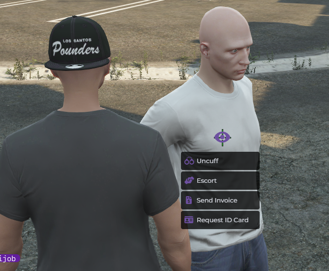
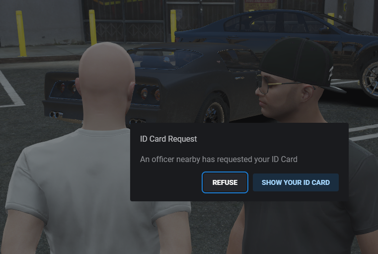
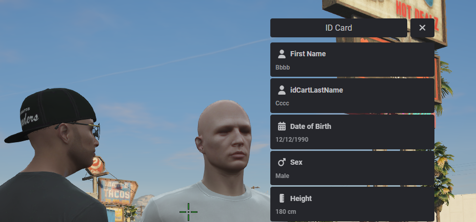
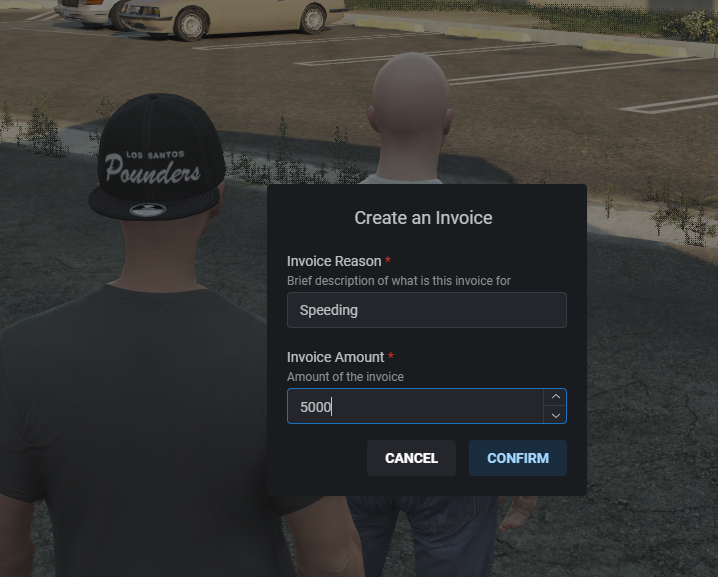
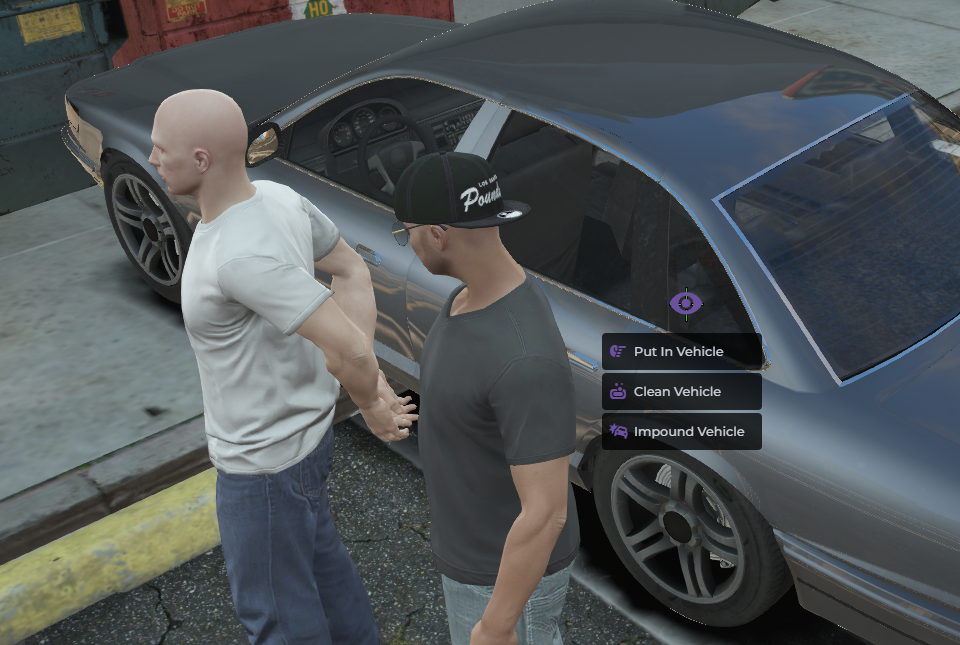
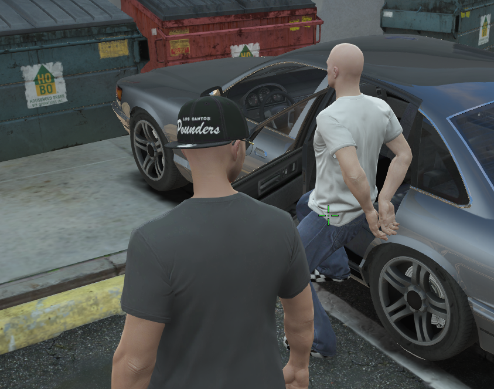
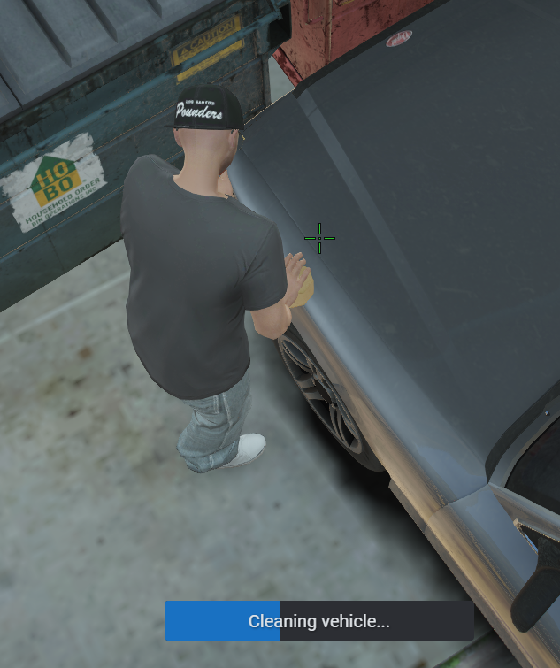
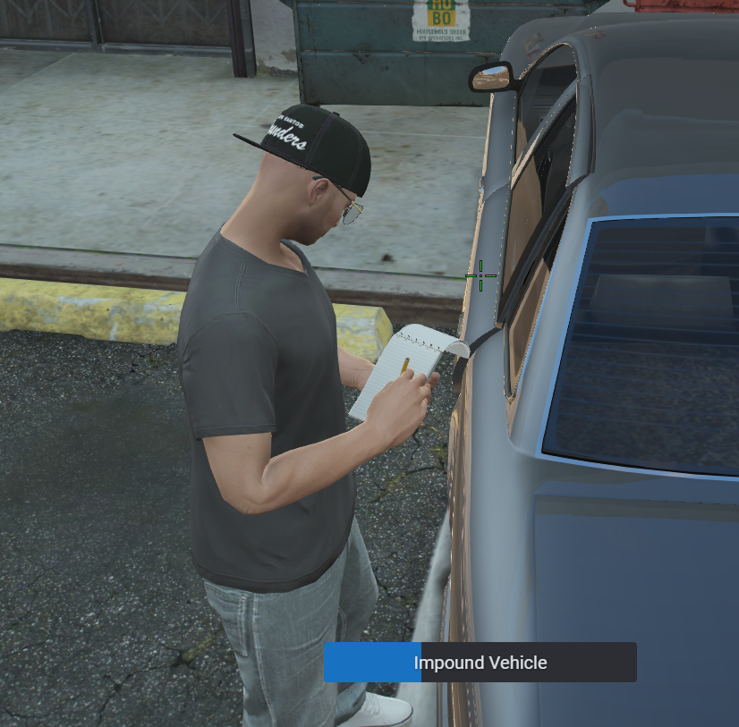
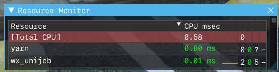
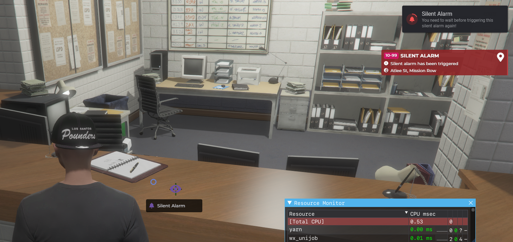
</details>

# Config File
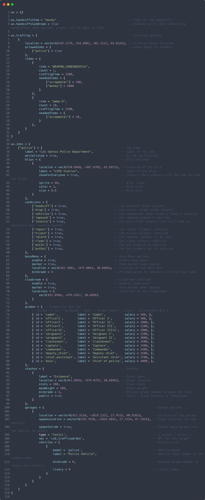

# Exports
```lua
exports.wx_unijob:isEscorted()
exports.wx_unijob:isHandcuffed()
exports.wx_unijob:openBossMenu(job)
exports.wx_unijob:openCloakroom()
```

# TODO

| Status | Function                     | Description                                                                                             |
| ------ | ---------------------------- | ------------------------------------------------------------------------------------------------------- |
| ✅      | Cloakrooms                   | Done and Functional                                                                                     |
| ✅      | Crafting                     | Done and Functional                                                                                     |
| ✅      | Garages                      | Done and Functional                                                                                     |
| ✅      | Impound                      | Done and Functional                                                                                     |
| ✅      | Invoices                     | Done and Functional                                                                                     |
| ✅      | Handcuffing / Uncuffing      | Done and Functional                                                                                     |
| ✅      | Vehicle Repairing            | Done and Functional                                                                                     |
| ✅      | Automatic Job Creation       | Automatically inserts jobs and it's grades from the config to the database if they're not there already |
| ✅      | Bossmenu                     | Done and Functional                                                                                     |
| ✅      | Vehicle Hijacking            | Done and Functional                                                                                     |
| ✅      | Player Escorting / Dragging  | Done and Functional                                                                                     |
| ✅      | Stashes                      | Done and Functional                                                                                     |
| ✅      | Blips                        | Done and Functional                                                                                     |
| ✅      | Markers                      | Done and Functional                                                                                     |
| ✅      | Config Comments              | Done                                                                                                    |
| ✅      | Vehicle Cleaning             | Done  and Functional                                                                                    |
| ✅      | ID Card Request              | Done  and Functional                                                                                    |
| ✅      | Put in / Take out of vehicle | Done  and Functional                                                                                    |
| ✅      | Locales                      | Done and Functional                                                                                     |
| ✅      | Blips                        | Done and Functional                                                                                     |
| ✅      | (Discord) logging            | Done and functional                                                                                     |
| ✅      | Silent Alarm                 | Done and functional                                                                                     |
| ❌      | Shops                        | TODO                                                                                                    |
| ❌      | Item Collecting Points       | TODO                                                                                                    |
| ❌      | Sell Points                  | TODO                                                                                                    |
| ❌      | Duty system                  | TODO                                                                                                    |
| ❌      | Radial Menus                 | TODO                                                                                                    |
| ❌      | Job Editing with Command     | Same shit as the warehouse edit                                                                         |

# Credits

### The [overextended](https://overextended.dev) team
* [ox_lib](https://github.com/overextended/ox_lib)
* [oxmysql](https://github.com/overextended/oxmysql)

### [Hoaxik](https://github.com/hoaxik)
* Help with a lot of this code
* * SQL Functions
* * Vehicle Hijacking
* * Vehicle Repair
* * Client functions
* * ... and a lot more!